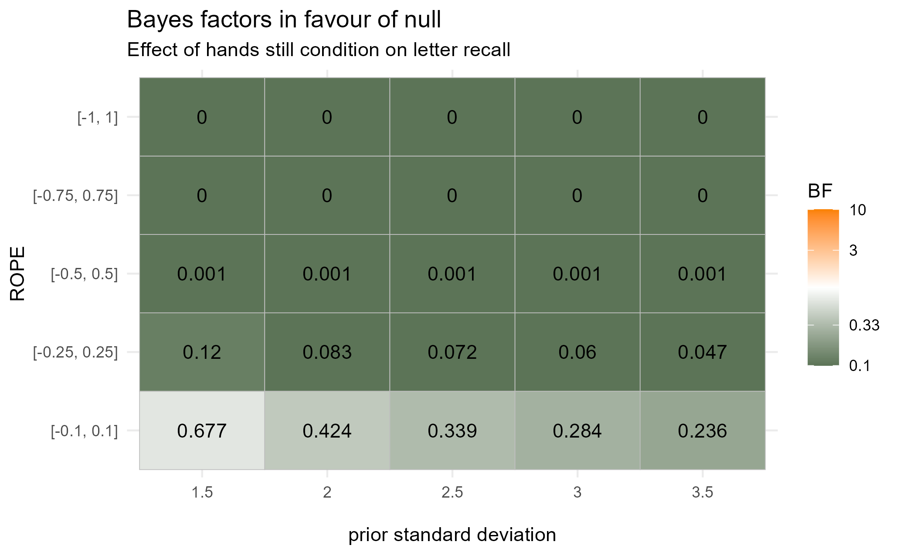
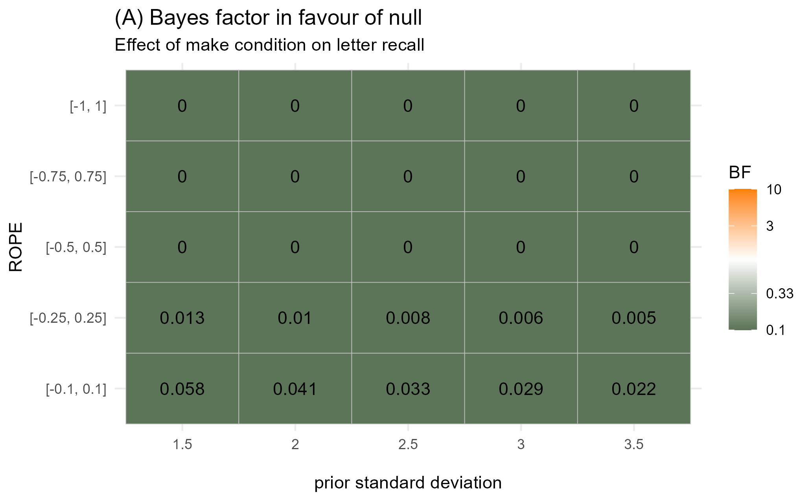
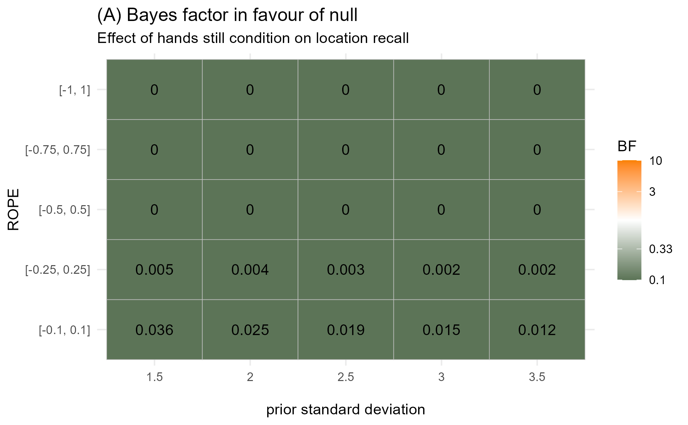
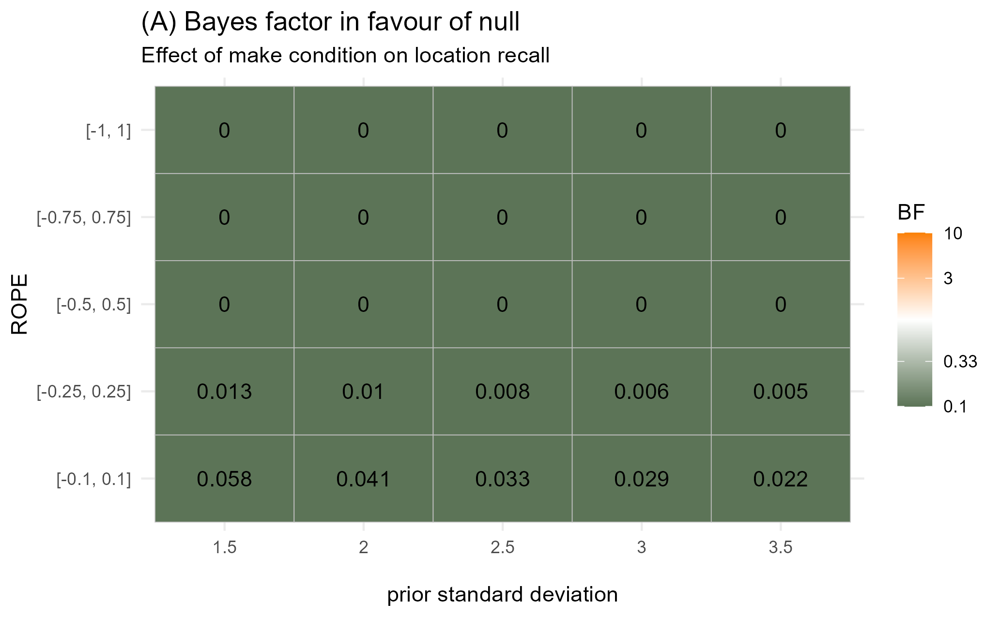

# Preamble: Loading packages and configuration

```{r}
#| label: data_and_libraries
#| echo: false

# just run this code chunk
# function to ignoring the setting of the relative path below when knitting
run_if_not_knitting <- function(expr) {
  if (!isTRUE(getOption("knitr.in.progress"))) {
    eval(expr)
  }
}

# nifty code using the pacman package
# it checks if the packages specified below are installed, if not, they will be installed, if yes, they will be loaded
if (!require("pacman")) install.packages("pacman")
pacman::p_load(rstudioapi, tidyverse, tidybayes, brms, bayestestR, modelr)

# set the current working directory to the one where this file is
run_if_not_knitting(current_working_dir <- dirname(rstudioapi::getActiveDocumentContext()$path))
run_if_not_knitting(setwd(current_working_dir))
```

# Article

Hostetter, A. B., & Bahl, S. (2023). Comparing the cognitive load of gesture and action production: A dual-task study. *Language and Cognition*, *15*(3), 601–621. <https://doi.org/10.1017/langcog.2023.23>

@hostetter_comparing_2023

# Buddy Challenge Task 4

*Run a series of Bayesian models equivalent to the critical model in the original article that originally did not converge:*

(a) *run the closest equivalent of their analysis (i.e. same structure but using flat priors)*
(b) *run a proper model with proper, weakly informative priors and justify your prior choices; interpret the results relative to the research question by interpreting the posteriors relative to zero; write up the results and write a report on the comparison between your reanalysis and their original analysis. Write at least 500 words in which you describe your analysis including your prior choices and compare the results between your analysis and the original analysis both quantitatively and qualitatively (do the analyses arrive at the same conclusions?). add the report to your GitHub Repo from Part 3.*

# Data Preparation

Repeating our data-tidying from the analytical reproduction, using a new copy of the data CSV.

## Load the data

```{r}
#| label: load-gesture

# Load a copy of the original data into a dataframe
gesture <- read_csv('bayesian_repro_data.csv')

# Have a look
head(gesture)
```

## Tidy the data

```{r}
#| label: tidy-gesture

# Exclude the data in which participant didn't follow the instructions
gesture_tidy <- gesture |>
  filter(Include == 'y')

# Remove columns we will not use
gesture_tidy <- gesture_tidy |>
  select(- c(Script,
             `Index Words`,
            `Start Time`,
              Transcript,
         `End Time`,
         Comment,
         Include,
         TimeTalking)) |>
  # Make the column names more stylistically consistent
  # And make them better reflect terminology used in the article
  rename(Item = Trial, # We are guessing they use 'trial' to record specific combinations of grid and dot pattern, which they refer to when modeling as 'item'
         Deictic = index.speech,
         Time_speaking = Seconds,
         Word_count = wordcount,
         Filled_pauses = Disfluenices,
         Letters_recalled = Letters,
         Locations_recalled = Locations,
         Total_recalled = Both) |>
  # Make condition labels clearer
  mutate(Condition = case_when(Condition == 'M' ~ 'Make',
                               Condition == 'G' ~ 'Gesture',
                               Condition == 'NG' ~ 'Hands still'),
         # Convert letters and locations recalled to numeric, so we can predict them
         # with a linear model later
         Letters_recalled = as.numeric(Letters_recalled),
         Locations_recalled = as.numeric(Locations_recalled),
         # make condition a factor, for difflsmeans later
         Condition = as.factor(Condition))
```

# a) Model with flat priors

Focusing on the final part of the article's study 1 analysis, since it actually addresses their main research question.

## Get priors

```{r}
#| label: model formulas

# set model formulas for final two models

letters_formula <- bf(Letters_recalled ~                          
                       Condition +                          
                       Filled_pauses +                          
                       (1 + Condition | Participant) +                      
                       (1 + Condition | Item))  


locations_formula <- bf(Locations_recalled ~                            
                          Condition +                            
                          Filled_pauses +                            
                          Deictic +                            
                          (1 + Condition | Participant) +                       
                          (1 + Condition | Item))  
# check priors 
get_prior(letters_formula, gesture_tidy)  

get_prior(locations_formula, gesture_tidy)

  # priors are functionally identical for both models, so we will be using one set of priors for letters and locations models 
```

## Model

```{r}
#| label: models1 

# specify uniform priors 
priors_flat <- c(# System would prefer we specify argument `lb` & `ub` to make explicit lower and upper bounds. Also for class `b`.
                    prior(uniform(0,5), class  = 'Intercept'),  
                    # `b` priors are flat by default apparently, but still
                    prior(uniform(-5, 5), class = 'b'),
                    # `sd` priors describe random effects
                    prior(uniform(-5, 5), class = 'sd'),
                    # This also seems to be the default, but we state it explicitly
                    prior(lkj(1), class = 'cor'))  

# run letters model 
letters_mdl_flat <- brm(letters_formula,                    
                   family = gaussian(),                    
                   prior = letters_priors,                    
                   data = gesture_tidy,
                   file = 'models/letters_mdl_flat.RDS',
                   # MCMC specs:                    
                   chains = 4, cores = 4,                    
                   iter = 2000, warmup = 1000,                    
                   thin = 1, seed = 16)  

# model output 
letters_mdl_flat

# run locations model 
locations_mdl_flat <- brm(locations_formula,                    
                     family = gaussian(),                    
                     prior = locations_priors,                    
                     data = gesture_tidy,    
                     file = 'models/locations_mdl_flat.RDS',
                     # MCMC specs:                    
                     chains = 4, cores = 4,                    
                     iter = 2000, warmup = 1000,                    
                     thin = 1, seed = 16)  

# model output 
locations_mdl_flat
```

# b) Model with weakly informative priors

## Set priors and run model

```{r}
#| label: models3

# Set weakly informative priors for intercept and predictors.
priors_informative <- 
  c(prior(normal(2.5, 2.5), class = 'Intercept'),
    prior(normal(0, 2.5), class = 'b'),
    prior(normal(0, 2.5), class = 'sd'),
    prior(lkj(1), class = 'cor'),
    prior(normal(0, 2.5), class = "sigma"))
  # Text copied from Jo:
  # We do not manually specify priors for the fixed effects (class = "b");
  # brms defaults are the closest practical analogue to flat/diffuse priors here.
  # Random-effect standard deviations need proper priors in a Bayesian MLM.
  # A broad Student-t prior is weakly informative and computationally safer than a bounded uniform prior.
  
  # Residual standard deviation also needs a proper positive prior.
 # Again, we use a broad weakly informative Student-t.
  

# Run bayesian model with weakly informative priors
letters_model_informative <-
  brm(letters_formula,
       family = gaussian(),
       prior = priors_informative,
       data = gesture_tidy,
       # Save model in a nearby file
       file = "models/letters_mdl_informative.RDS",
       chains = 4, cores = 4, 
       iter = 2000, warmup = 1000,
       thin = 1, seed = 16)

letters_model_informative

locations_model_informative <- 
  brm(locations_formula,
       family = gaussian(),
       prior = priors_informative,
       data = gesture_tidy,
       # Save model in a nearby file
       file = "models/locations_mdl_informative.RDS",
       chains = 4, cores = 4, 
       iter = 2000, warmup = 1000,
       thin = 1, seed = 16)

locations_model_informative
```

## Interpret the results

### Checks and posterior plotting

```{r}
#| label: checks

pp_check(letters_model_informative, ndraws = 100)

pp_check(locations_model_informative, ndraws = 100)

mcmc_plot(letters_model_informative, type = 'trace')
mcmc_plot(locations_model_informative, type = 'trace')

# Shit goes kinda flimpy over there.

mcmc_dens_overlay(letters_model_informative)

# No. Not legible. For our human eyes anyway.

p_direction(letters_model_informative)
p_direction(locations_model_informative)

# Plot the posteriors

letters_model_informative |> 
  spread_draws(b_ConditionHandsstill, b_ConditionMake, b_Filled_pauses) |>
  gather_draws(b_ConditionHandsstill, b_ConditionMake, b_Filled_pauses) |> 
  ggplot(aes(x = .value)) +
  stat_halfeye(fill = '#756bb1') +
  geom_vline(xintercept = 0, lty = 'dashed') +
  geom_density(fill = "#bcbddc", alpha = 0.5) +
  facet_wrap(~ .variable, scales = "free") +
  labs(
    x = "\nPosterior slope",
    y = "Density\n",
    title = "Distribution of posteriors for model predicting letter recall\n") +
  theme_minimal()

locations_model_informative |> 
  spread_draws(b_ConditionHandsstill, b_ConditionMake, b_Filled_pauses, b_Deictic) |>
  gather_draws(b_ConditionHandsstill, b_ConditionMake, b_Filled_pauses, b_Deictic) |> 
  ggplot(aes(x = .value)) +
  stat_halfeye(fill = '#756bb1') +
  geom_vline(xintercept = 0, lty = 'dashed') +
  geom_density(fill = "#bcbddc", alpha = 0.5) +
  facet_wrap(~ .variable, scales = "free") +
  labs(
    x = "\nPosterior slope",
    y = "Density\n",
    title = "Distribution of posteriors for model predicting location recall\n") +
  theme_minimal()
```

### Bayes Factor

```{r}
#| label: bayes_factors 

# Extract posteriors

letters_posteriors <- letters_model_informative |> 
  spread_draws(b_ConditionHandsstill, b_ConditionMake, b_Filled_pauses) |>
  select(b_ConditionHandsstill, b_ConditionMake, b_Filled_pauses)

locations_posteriors <- locations_model_informative |> 
  spread_draws(b_ConditionHandsstill, b_ConditionMake, b_Filled_pauses, b_Deictic) |>
  select(b_ConditionHandsstill, b_ConditionMake, b_Filled_pauses, b_Deictic)

# Create prior models

letters_model_prior <-
  brm(letters_formula,
       family = gaussian(),
       prior = priors_informative,
       sample_prior = 'only',
       data = gesture_tidy,
       # Save model in a nearby file
       file = "models/letters_mdl_prior.RDS",
       chains = 4, cores = 4, 
       iter = 2000, warmup = 1000,
       thin = 1, seed = 16)

locations_model_prior <- 
  brm(locations_formula,
       family = gaussian(),
       prior = priors_informative,
       sample_prior = 'only',
       data = gesture_tidy,
       # Save model in a nearby file
       file = "models/locations_mdl_prior.RDS",
       chains = 4, cores = 4, 
       iter = 2000, warmup = 1000,
       thin = 1, seed = 16)

# Extract priors

letters_priors <- letters_model_prior |> 
  spread_draws(b_ConditionHandsstill, b_ConditionMake, b_Filled_pauses) |>
  select(b_ConditionHandsstill, b_ConditionMake, b_Filled_pauses)

locations_priors <- locations_model_prior |> spread_draws(b_ConditionHandsstill, b_ConditionMake, b_Filled_pauses, b_Deictic) |>
  select(b_ConditionHandsstill, b_ConditionMake, b_Filled_pauses, b_Deictic)

# Bayes Factor for letters model
bayesfactor_parameters(letters_posteriors, letters_priors, direction = "two-sided", null = 0)

# Bayes Factor for locations model
bayesfactor_parameters(locations_posteriors, locations_priors, direction = "two-sided", null = 0)

```

For the model predicting correct recall of letters (0-5 recalled correctly), the 'condition' predictor has a base level of 'gesture', and alternate levels of 'hands still' and 'make'. The Bayes factor for hands still as opposed to gesture is 0.581, indicating anecdotal evidence favoring the null hypothesis that there is no effect of hands still condition. The Bayes factor for make is 0.062, indicating strong evidence favoring the null. The 'filled pauses' predictor is numeric (ranging from 0-13), using the number of filled pauses recorded as a predictor of letter recall. Its Bayes factor is 0.015, indicating very strong evidence favoring the null that there is no effect of filled pauses.

For the model predicting correct recall of locations (0-5 recalled correctly), condition and filled pauses predictor are also used. The Bayes factor for hands still as opposed to gesture is 0.046, indicating strong evidence favoring the null hypothesis that there is no effect of hands still condition. The Bayes factor for make is 0.065, indicating strong evidence favoring the null. The Bayes factor for filled pauses is 0.027, indicating very strong evidence favoring the null that there is no effect of filled pauses. This model also uses number of deictic references as a predictor (ranging from 0-1), which has a Bayes factor of 1.45, indicating anecdotal evidence favoring the alternative hypothesis that there is an effect of deictic references on locations recalled.

### Write-up

*Task: write a report on the comparison between your reanalysis and their original analysis. Write at least 500 words in which you describe your analysis including your prior choices and compare the results between your analysis and the original analysis both quantitatively and qualitatively (do the analyses arrive at the same conclusions?). Add the report to your GitHub Repo from Part 3.*

# Buddy Challenge Task 5:

# Hypothesis testing using ROPEs

*Define the smallest effect size of interest for the original research question and do a literature research to justify your choice.*

-   *rerun your hypothesis test combining the concepts of Bayes Factor (BF) and Regions of Practical Equivalence (ROPE) (according to Roettger & Franke's method, 2025)*

-   *run a sensitivity analyses for different ROPES and priors; write up the results accordingly*

-   *save the analysis and report in your Github repository*

```{r}
#| label: ROPEs

# set a ROPE based on a SESOI of 0.25 letters
rope <- c(-0.25, 0.25)

# calculate Bayes Factor using the ROPE
  # for the letters model
bayesfactor_rope(posterior = letters_model_informative,
                 prior = letters_model_prior,
                 null = rope,
                 parameters = c('b_ConditionHandsstill', # ~ 0.07
                                'b_ConditionMake', # < 0.01
                                'b_Filled_pauses')) # < 0.01

  # for the locations model
bayesfactor_rope(posterior = locations_model_informative,
                 prior = locations_model_prior,
                 null = rope,
                 parameters = c('b_ConditionHandsstill', # < 0.01
                                'b_ConditionMake', # < 0.01
                                'b_Filled_pauses', # < 0.01
                                'b_Deictic')) # ~ 0.21
```

### Results based on our chosen priors and SESOI

Using a SESOI (smallest effect size of interest) of 0.25 letters/locations recalled, we calculate the Savage-Dickey density ratio [@roettger_meaningful_2025]. This lets us assess evidence for and against the null hypothesis that the effect of each predictor lies between -0.25 and 0.25, using a Bayes factor. All Bayes factors predict strong to extreme evidence in favor of the null hypothesis [@lee2014] that the given predictor does not have a meaningful effect on recall.

With respect to the authors' prediction that 'gesturing will lead to better performance on a secondary task than speaking with hands still' \[\@hostetter_comparing_2023, p. 604\], the relevant Bayes factors are \~ 0.07 for letters and \< 0.01 for locations. So after seeing the data, our posterior belief that the difference between the 'gesture' and 'hands still' conditions is outside the ROPE is 0.07 and less than 0.01 times as probable after seeing the data, i.e. far less probable.

While the authors do not state a hypothesis regarding the effect of the 'make' condition on recall, with respect to their question 'whether speech accompanying actions have a similar benefit', the relevant Bayes factores are \< 0.01 for both letters and locations. So, after seeing the data, our posterior beliefs that the difference between the 'gesture' and 'make' conditions is outside the ROPE is far less probable.

As neither filled pauses nor deictic references are referenced by the authors as predictors of interest prior to running their analysis, we do not focus on these in our analysis of meaningful effect sizes.

### SESOI Justification

While, for a given trial, measurement of recall is limited to whole letters/locations recalled out of 6, our SESOI is smaller than one letter, as we consider the potential effects on memory over the course of many trials.

We define a SESOI of 0.25 of a letter/location recalled, which is equivalent to 5% total recall of 5 letters/locations. This proportion is based on @langerock_cognitive_2025, which investigates the effects of lower vs. higher cognitive load-demanding tasks on recall, and reports effect sizes in the range of 5-15% recall difference within the scope of a given task. This is also supported by @rohrer_beat_2020 and @goldin-meadow_explaining_2001, which investigate recall as a function of gesture/non-gesture condition using different experimental designs, and report effects in the range of approximately 5-15% recall difference.

It is important to note that Hostetter and Bahl's study uses increased recall on a secondary task as a proxy for the actual effect of interest, decreased cognitive load on the primary task where the occurs. The proposed mechanism is indirect and likely noisy, so we do not expect a large effect size.

Based on the goal that these findings should be useful in future research, we consider a ROPE of ±5% difference in recall to be much more meaningful than a point-zero null. Thus, we select 5%, on the lower end of the scale, with the plan to investigate the robustness of this effect across a wider range of ROPEs.

## Sensitivity analysis

### Exploring varying priors

```{r}
#| label: models with varying priors

# DO NOT RUN THIS CHUNK, MODELS HAVE ALREADY BEEN SAVED
# Repeat our priors for all parameters except the predictors (class 'b')
priors <- c(prior(normal(2.5, 2.5), class = 'Intercept'),
            prior(normal(0, 2.5), class = 'sd'),
            prior(lkj(1), class = 'cor'),
            prior(normal(0, 2.5), class = "sigma"))

# five different prior widths that are reasonable
priors_1.5 <- c(priors, prior(normal(0, 1.5), class = 'b'))
priors_2 <- c(priors, prior(normal(0, 2), class = 'b'))
# our original prior width
priors_2.5 <- c(priors, prior(normal(0, 2.5), class = 'b'))
priors_3 <- c(priors, prior(normal(0, 3), class = 'b'))
priors_3.5 <- c(priors, prior(normal(0, 3.5), class = 'b'))

# Define a list of these prior specifications
prior_list <- list(priors_1.5,
                   priors_2,
                   priors_2.5,
                   priors_3,
                   priors_3.5)

#initialise lists to store models
letters_model_list <- list()
locations_model_list <- list()

# Loop over the priors for letters models
for (i in seq_along(prior_list)) {
  letters_model_list[[i]] <-
     brm(letters_formula,
       family = gaussian(),
       prior = prior_list[[i]],
       data = gesture_tidy,
       chains = 4, cores = 4, 
       iter = 2000, warmup = 1000,
       thin = 1, seed = 16)
}

# name models
names(letters_model_list) <- paste0("full_model_with_prior_", c(1.5,2,2.5,3,3.5))
# save models
saveRDS(letters_model_list, "models/letters_model_loop.RDS")


# Loop over the priors for locations models
for (i in seq_along(prior_list)) {
  locations_model_list[[i]] <-
     brm(locations_formula,
       family = gaussian(),
       prior = prior_list[[i]],
       data = gesture_tidy,
       chains = 4, cores = 4, 
       iter = 2000, warmup = 1000,
       thin = 1, seed = 16)
}

# name models
names(locations_model_list) <- paste0("full_model_with_prior_", c(1.5,2,2.5,3,3.5))
# save models
saveRDS(locations_model_list, "models/locations_model_loop.RDS")
```

```{r}
#| label: loading in the model lists

# load models into new objects
letters_model_list <- readRDS("models/letters_model_loop.RDS")
locations_model_list <- readRDS("models/locations_model_loop.RDS")
```

### Exploring varying ROPEs

```{r}
#| label: exploring different ROPEs

# specify different ROPE intervals of interest
ropes <- list(c(-0.1, 0.1),
              c(-0.25, 0.25),
              c(-0.5, 0.5),
              c(-0.75, 0.75),
              c(-1, 1))

# loop through different ropes: LETTERS
letters_results <- map_dfr(names(letters_model_list), function(model_name) {
  model <- letters_model_list[[model_name]]
  
  map_dfr(ropes, function(interval) {
    lower <- interval[1]
    upper <- interval[2]
    
    bayesfactor_parameters(
      model,
      null = c(lower, upper),
      parameters = c('b_ConditionHandsstill', 
                                'b_ConditionMake', 
                                'b_Filled_pauses')
    ) %>%
      as_tibble() %>%
      mutate(
        model = model_name,
        interval_range = paste0("[", lower, ", ", upper, "]")
      ) %>%
      select(model, everything())
  })
})

# wrangle per parameter (I've ignored the results for filled pauses because that's not relevant for the hypotheses)
letters_results_handsstill <- letters_results |> 
  filter(Parameter == "b_ConditionHandsstill") |> 
  separate(model, sep = "_", into = c(NA, NA, NA, NA, "prior_sd")) |> 
  mutate(BF = exp(log_BF)) |> 
  select(prior_sd, BF, interval_range)

letters_results_make <- letters_results |> 
  filter(Parameter == "b_ConditionMake") |> 
  separate(model, sep = "_", into = c(NA, NA, NA, NA, "prior_sd")) |> 
  mutate(BF = exp(log_BF)) |> 
  select(prior_sd, BF, interval_range)

# save results to prevent having to rerun these model combinations
write_csv(letters_results_handsstill, "output/letters_sensitivity_handsstill.csv")
write_csv(letters_results_make, "output/letters_sensitivity_make.csv")

# loop through different ropes: LOCATIONS
locations_results <- map_dfr(names(locations_model_list), function(model_name) {
  model <- locations_model_list[[model_name]]
  
  map_dfr(ropes, function(interval) {
    lower <- interval[1]
    upper <- interval[2]
    
    bayesfactor_parameters(
      model,
      null = c(lower, upper),
      parameters = c('b_ConditionHandsstill', 
                                'b_ConditionMake', 
                                'b_Filled_pauses',
                                'b_Deictic')
    ) %>%
      as_tibble() %>%
      mutate(
        model = model_name,
        interval_range = paste0("[", lower, ", ", upper, "]")
      ) %>%
      select(model, everything())
  })
})

# wrangle per parameter (I've ignored the results for fixed pauses because that's not relevant for the hypotheses)
locations_results_handsstill <- locations_results |> 
  filter(Parameter == "b_ConditionHandsstill") |> 
  separate(model, sep = "_", into = c(NA, NA, NA, NA, "prior_sd")) |> 
  mutate(BF = exp(log_BF)) |> 
  select(prior_sd, BF, interval_range)

locations_results_make <- locations_results |> 
  filter(Parameter == "b_ConditionMake") |> 
  separate(model, sep = "_", into = c(NA, NA, NA, NA, "prior_sd")) |> 
  mutate(BF = exp(log_BF)) |> 
  select(prior_sd, BF, interval_range)

# save results to prevent having to rerun these model combinations
write_csv(locations_results_handsstill, "output/locations_sensitivity_handsstill.csv")
write_csv(locations_results_make, "output/locations_sensitivity_make.csv")
```

```{r}
#| label: sensitivity analysis plots

# visualise the BFs for the hands still condition in the letter models 
letters_handsstill_plot <- ggplot(letters_results_handsstill,
       aes(x = as.factor(prior_sd),
           y = as.factor(interval_range),
           fill = BF)) +
  geom_tile(colour = "grey") +
  geom_text(aes(label = round(BF,3))) +
  scale_fill_gradient2(transform = "log",
                       limits = c(0.1,10),
                       midpoint = 1, 
                       low = "#5C7457", 
                       high = "#FA8100",
                       breaks = c(0.00000,0.03,0.1,0.33,0,3,10),
                       labels = c("0","0.03","0.1","0.33","1","3","10"),
                       oob = scales::squish
                       ) +
  labs(title = "(A) Bayes factor in favour of null", 
       subtitle = "Effect of hands still condition on letter recall",
       fill = "BF",
       y = "ROPE",
       x = "\nprior standard deviation") +
  theme_minimal()

letters_handsstill_plot

# save plot
ggsave("output/letters_handsstill_sensitivity.png",
       plot = letters_handsstill_plot)

# visualise the BFs for the make condition in the letter models 
letters_make_plot <- ggplot(letters_results_make,
       aes(x = as.factor(prior_sd),
           y = as.factor(interval_range),
           fill = BF)) +
  geom_tile(colour = "grey") +
  geom_text(aes(label = round(BF,3))) +
  scale_fill_gradient2(transform = "log",
                       limits = c(0.1,10),
                       midpoint = 1, 
                       low = "#5C7457", 
                       high = "#FA8100",
                       breaks = c(0.00000,0.03,0.1,0.33,0,3,10),
                       labels = c("0","0.03","0.1","0.33","1","3","10"),
                       oob = scales::squish
                       ) +
  labs(title = "(A) Bayes factor in favour of null", 
       subtitle = "Effect of make condition on letter recall",
       fill = "BF",
       y = "ROPE",
       x = "\nprior standard deviation") +
  theme_minimal()

letters_make_plot

# save plot
ggsave("output/letters_make_sensitivity.png",
       plot = letters_make_plot)

# visualise the BFs for the hands still condition in the location models
locations_handsstill_plot <- ggplot(locations_results_handsstill,
       aes(x = as.factor(prior_sd),
           y = as.factor(interval_range),
           fill = BF)) +
  geom_tile(colour = "grey") +
  geom_text(aes(label = round(BF,3))) +
  scale_fill_gradient2(transform = "log",
                       limits = c(0.1,10),
                       midpoint = 1, 
                       low = "#5C7457", 
                       high = "#FA8100",
                       breaks = c(0.00000,0.03,0.1,0.33,0,3,10),
                       labels = c("0","0.03","0.1","0.33","1","3","10"),
                       oob = scales::squish
                       ) +
  labs(title = "(A) Bayes factor in favour of null", 
       subtitle = "Effect of hands still condition on location recall",
       fill = "BF",
       y = "ROPE",
       x = "\nprior standard deviation") +
  theme_minimal()

locations_handsstill_plot

# save plot
ggsave("output/locations_handsstill_sensitivity.png",
       plot = locations_handsstill_plot)

# visualise the BFs for the make condition in the location models
locations_make_plot <- ggplot(letters_results_make,
       aes(x = as.factor(prior_sd),
           y = as.factor(interval_range),
           fill = BF)) +
  geom_tile(colour = "grey") +
  geom_text(aes(label = round(BF,3))) +
  scale_fill_gradient2(transform = "log",
                       limits = c(0.1,10),
                       midpoint = 1, 
                       low = "#5C7457", 
                       high = "#FA8100",
                       breaks = c(0.00000,0.03,0.1,0.33,0,3,10),
                       labels = c("0","0.03","0.1","0.33","1","3","10"),
                       oob = scales::squish
                       ) +
  labs(title = "(A) Bayes factor in favour of null", 
       subtitle = "Effect of make condition on location recall",
       fill = "BF",
       y = "ROPE",
       x = "\nprior standard deviation") +
  theme_minimal()

locations_make_plot

# save plot
ggsave("output/locations_make_sensitivity.png",
       plot = locations_make_plot)
```

## Sensitivity analysis

To assess the robustness of our findings for the Letter and Location model, we conducted a sensitivity analysis across a range of ROPE widths and prior specifications. Across both models, the Bayes factors consistently favour the null hypothesis. These findings remain stable across various priors and ROPE widths.

**Letters Model**

*Hands-still condition*. Under a narrow ROPE (±0.1), there is weak evidence for the effect of the Hands-still condition (BF = 0.24-0.68) (Figure 1). For our pre-defined SESOI (±0.25), the Bayes factors are all below 0.1 (BF = 0.12-0.05). Under wider ROPEs (±0.5 and above), the Bayes factors is 0, indicating evidence for the null hypothesis.

{#fig-letters-handsstill alt="Figure 1: Letters model / Hands-still condition" fig-align="left" width="303"}

*Make condition*. Across all ROPEs and priors, the Bayes factors are really close to zero (Figure 2). This suggests strong evidence that the effect of the Make condition is negligible.

{alt="Figure 2: Letters model / Make" fig-align="left" width="303"}

**Locations Model**\

For the locations recalled model, both the Hands-still (Figure 3) and Make (Figure 4) conditions show strong evidence for the null at the SESOI level (±0.25), with Bayes factors very close to 0. For all ROPEs bigger that the SESOI (±0.5 and above), the Bayes factor is 0.

{alt="Figure 3: Locations model / Hands-still" width="303"}

{alt="Figure 4: Locations / Make" width="303"}

These results are highly robust to both prior choice and ROPE specification. Across all reasonable assumptions, the effects of condition on recall are consistently small and fall within regions of practical equivalence.

Our sensitivity analysis suggests that the across numerous reasonable assumptions, the effect of condition (make/hands-still) on recall is consistently very small. Even with our relatively conservative SESOI of ±0.25, the Bayes factors provide strong evidence that the effects are not practically meaningful. In Hostetter and Bahl (2023), their frequentist analysis resulted in statistically significant differences. In contrast, our bayesian re-analysis and our sensitivity analysis, suggest that the effects are too small to be of practical importance under a wide range of plausible model assumptions.

## References

<!-- References will auto-populate in the refs div below -->

::: {#refs}
\
:::
